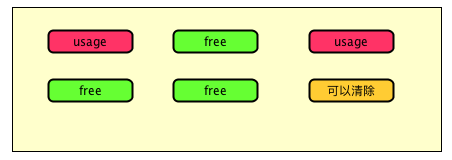
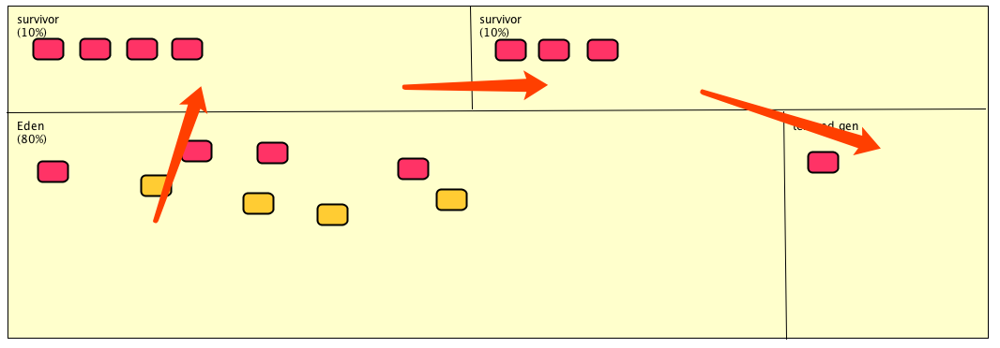

# 4.6.2：怎么回收?

### 1: 标记清除算法



```
1: 标记和清除的效率问题
2: 造成内存不连续-空间问题
```

### 2: 复制算法



```
堆内存
  - 新生代
    - eden 伊甸园
    - survival 存活区
  - tenured gen 老年区
  - perm gen 持久区
 
```


### 3: 标记整理算法

```
主要针对老年代内存进行回收
1: 标记
2: 整理 <多了整理的过程>
3: 清除
```


### 4: 分代收集算法

```
针对内存的分代选择不通的垃圾回收算法
针对eden 选择 复制算法
针对老年代 选择 标记整理算法
```


