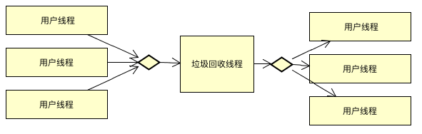
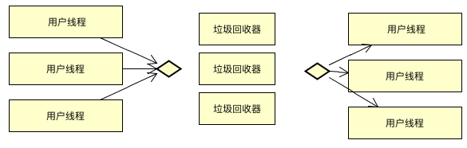

# 4.6.3：常见垃圾收集器

不同的收集器适用的场景不同

-XX:+PrintCommandLineFlags -version

### 1: serial



```
1.1 最悠久的收集器
1.2 单线程的垃圾回收器
1.3 看来只适合客户端程序(桌面应用)
1.4 会造成用户线程等待
打扫卫生和扔垃圾不能同时执行
```


### 2: parnew(新生代收集器)



```
2.1 多线程的收集器
2.2 仍然会造成用户等待
打扫卫生和扔垃圾不能同时执行
```


### 3: parallel(新生代收集器)

```
3.1 多线程收集器
3.2 达到可控制的吞吐量(cpu用于用户代码的总时间 与 cpu 整体运行时间的比值) 【与parnew的最根本的区别】

-XX:+MaxGCPauseMillis 垃圾收集器停顿的时间，如果设置的非常小，会造成收集频率高
-XX:GCTimeRatio 吞吐量的大小(0,100),默认值99,表示垃圾回收的时间只能占用到1%
```


### 4: cms(concurrent mark sweep )(用在老年代收集器)

```
工作过程
 - 初始标记
 - 并发标记
 - 重新标记
 - 并发清理 (边扔垃圾边打扫)
 
 优点
  - 并发手机
  - 低停顿
  
 缺点:
  - 只能有parnew协同工作
  - 占用大量的cpu资源
  - 有内存碎片
```


### 5: g1

```
优势
- 并行与并发
- 分代收集
- 空间整理
- 可预测的停顿

步骤
- 初始标记
- 并发标记
- 最终标记
- 筛选回收
```

