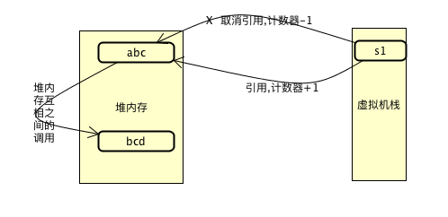
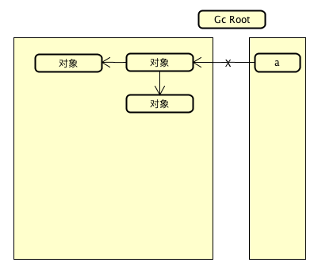

# 4.6.1：怎么判断垃圾对象?

### 1 : 引用计数法



```
在对象中添加一个引用计数器,当有地方引用到这个对象的时候,计数器+1,当引用失效的时候,计数器-1

优点:  非常的简单明了,通过计数器的方式,来判断当前是否可以被回收
缺点:  如果堆内存之间有相互的依赖关系,那么互相之间的计数器就不为0，这样即使不再使用,也无法被垃圾回收器回收
```

```java
案例:
运行时,配置:
* -verbose:gc  打印垃圾回收的日志信息
* -xx:+PrintGCDetails 打印垃圾回收的详细信息
public class GarbageCollect {
    private Object instance;

    public GarbageCollect() {
        byte[] by = new byte[20 * 1024 * 1024];
    }

    public static void main(String[] args) {
        GarbageCollect garbageCollect = new GarbageCollect();
        GarbageCollect garbageCollect1 = new GarbageCollect();
        garbageCollect.instance = garbageCollect1;
        garbageCollect1.instance = garbageCollect;
        garbageCollect = null;
        garbageCollect1 = null;
        System.gc();
    }
}
通过模拟互相调用的关系，即可清晰的看出,目前的jdk8并不是使用引用计数法.
```


### 2: 可达性分析法



```
定义GC ROOT,从GC ROOT向下搜索，走过的路径就是一个引用链，当没有任何引用链可以到达的时候,
就认为是不可用的
```

作为GC ROOT的对象的起点

- 虚拟机栈
- 方法区的类属性所应用的对象
- 方法区中的常量所引用的对象
- 本地方法栈中引用的对象

