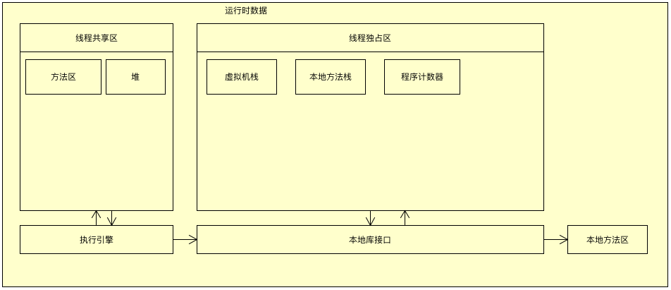
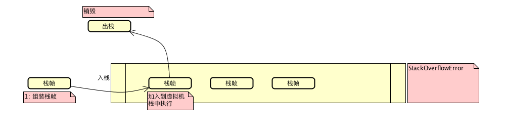

# 4.4：内存

### 1: 结构图



### 2: 内存详情

- 程序计数器

  ```
  1: 比较小的内存空间,当前线程所执行的字节码的行号指示器.
  2: 程序计数器处于线程的独占区.
     - 每个线程都有自己的程序计数器
  3: 如果执行的是java方法，计数器记录的是正在执行的虚拟机字节码指令的地址.
       -  随着线程的创建而创建
     如果执行的是native方法,计数器为undefined
       - 因为用c、c++写的代码,并不会产生字节码文件
  4: 唯一一个在java虚拟机中没有规定任何OutOfMemory区域，因为是java内部维护
       - 实际上只存储了字节码指令的地址,东西很少
  
  用途: 线程执行的时候,随时都会失去cpu资源而处于等待状态，等再次执行的时候,
  需要知道上一次具体执行到了哪,当前线程才可以继续.
  
  ```

- 虚拟机栈
  

  ```
  1: java执行的动态内存模型
  2: 栈帧: 存户方法的局部变量标，操作数栈，动态链接，出口等
     - 栈执行的时候，是一个个栈帧被执行
  3: 局部变量标
     - 存放编译期可知的各种基本数据类型,引用类型, returnAddress类型
     - 局部变量标在内存空间的编译器完成分配，进入方法时，在这个方法需要在帧中的分配内存是固定的，
  在方法运行期间是不会改变局部变量表的大小
  
  4: StackOverflowError 超出栈的深度
     OutOfMemoryError   栈的深度比较深,消耗的内存超过了虚拟机的限制 
     
  用途: 为虚拟机执行java方法服务
  ```

- 本地方法栈

  ```
  用途: 为虚拟机执行native方法服务
  在HotSpot中就是与虚拟机栈共用一块内存区域
  ```

- 堆内存

  ```
  1: 存放对象实例
  2: 垃圾收集器管理的主要区域
  3: 新生代、老年代、Eden空间
     - 如果申请不下来内存，会报错: OutOfMemory
     -Xms20m -Xmx20m 来进行控制堆内存的大小
  ```

  

- 方法区
  [4.4.1常量](memory_constants.md)

  ```
  1: 存储虚拟机加载的类信息
     - 类的版本
     - 类的字段
     - 类的方法
     - 累的接口
     
  2: 常量
  
  3: 静态变量
  
  4: 即时变异后的代码等数据
  
  5: 方法区和永久代
     - 方法区 != 永久代(hotspot)
     
  6: 垃圾回收在方法区的行为  
     - 方法区中出现的比较少,因为垃圾回收的效率比较低
     - 但是也有，比如常量池的回收和类的卸载
     
  7: 异常的定义
     OutOfMemory
  ```