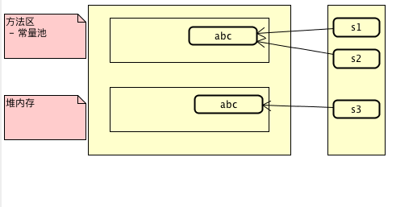

# 4.4.1：常量

### 1: java代码

```java
 public static void main(String[] args) {
        String s1 = "abc";
        String s2 = "abc";
        String s3 = new String("abc");

        System.out.println(s1 == s2);
        System.out.println(s1 == s3);
        System.out.println(s1 == s3.intern());
 }
输出结果:
true
false
true
```


### 2:内存分配模型



```
1: s1,s2 在虚拟机栈中,存储的是在方法区-常量池中的"abc"的引用
2: 方法区-常量池 维护的是一个类似hashSet的常量池,无序,但是也不会重复
3: 使用new创建的对象,jvm不经过考虑,一定是直接创建到了堆内存里面的
4: s3.intern()其实就是运行时常量,这个数据也是需要存储到方法区-常量池里面的
```

