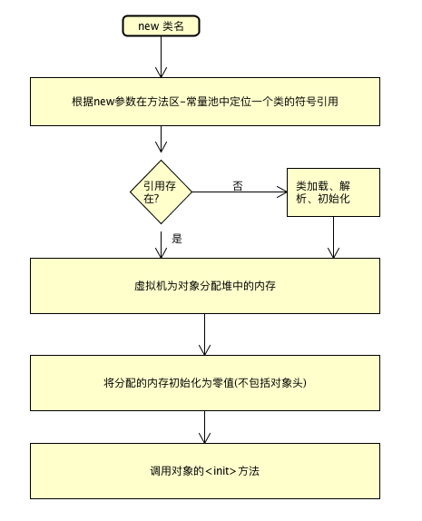
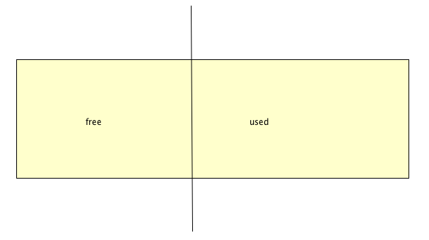
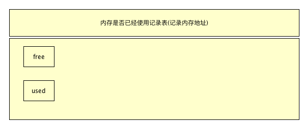

# 4.4.2：对象的创建

### 1 : 对象创建的结构图




### 2: 给对象分配内存

- 指针碰撞
  

  ```
  假设内存是连续的,从右往做，使用一块，指针移动一块
  缺点: 内存的使用并不是连续的
  如果垃圾回收机制可以进行内存的规整的话
  ```

  

- 空闲列表
  

```
有一个表来记录内存是否已经使用，对于已经使用的，标记为used,对于回收的，再标记为free
```


### 3: 线程的安全性问题

```
原因: 内存的分配,在并发的情况下,有可能产生冲突

解决方案: 
1: 线程同步
2: 本地线程分配缓冲(TLAB)
```


### 4: 初始化对象

```
在jvm已经产生,进行初始化对象，比如
int default = 0
Object a = null;
```


### 5: 执行构造方法

```
初始化完成的最后一步,会执行构造方法
```

