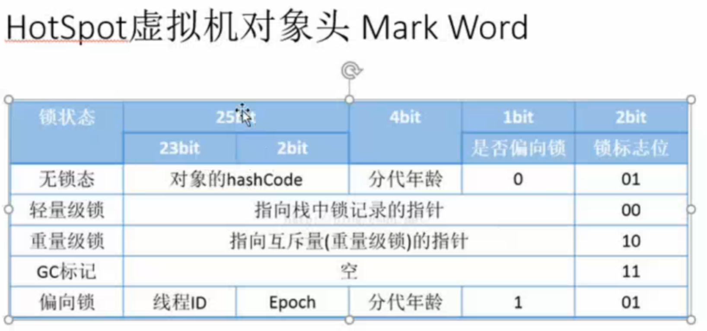

# 4.4.3：对象的结构

### 1: Header(对象头)

- 自身运行时数据(占32位或者64位- mark word)
  

  ```
  1: hash值
  2: GC 分代年龄
  3: 锁状态标志
  4: 线程持有的锁
  5: 偏向线程id和偏向线程戳
  ```

- 类型指针

  ```
  对象指向元数据的类型指针
  ```

### 2: InstanceData(数据实例)

```
1: 相同宽度的字段会分配到一块
```


### 3: Padding

```
占位符,对象的大小必须是8个字节的整数倍,并没有实际的意义
```


