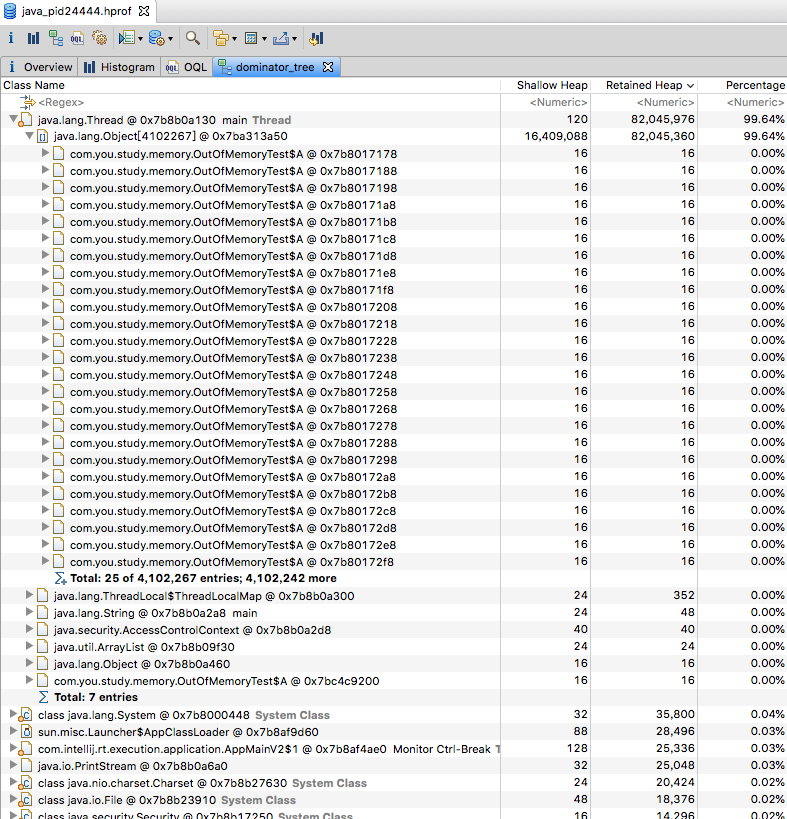
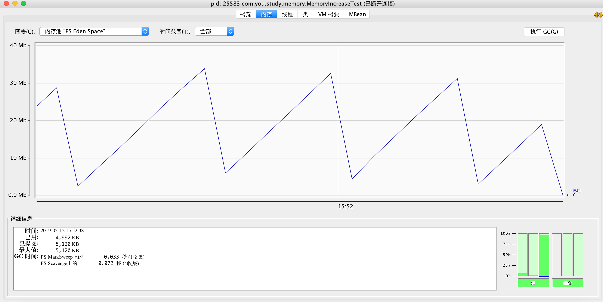

# 4.2：工具准备

## 1: [下载MAT工具](https://www.eclipse.org/mat/downloads.php)

```
intellij idea 下没有很好的分析工具,转向eclipse 插件mat, 但是又不想下载eclipse,
于是,下载mat独立可执行版本
```


### 2: 运行MAT

```
mac 笔记本，直接执行出错,在终端直接执行即可:
/Users/XXX/Documents/mat/mat.app/Contents/MacOS/MemoryAnalyzer; exit
```


### 3 : 使用

```
倒入dump下来的hprof文件即可
```




### 4: Jconsole

```
直接终端敲击 jconsole 即可
```

